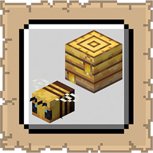

# Bee GUI

  

   
A lightweight mod that adds an inspection GUI for bee hives and bee nests.

## Functionality

  

   
Bee GUI lets you inspect the inside of any Bee Hive or Bee Nest by right-clicking it. A small GUI panel opens showing.

* **Up to 3 Bee Slots:** Each displaying the bee's icon (normal, baby, with nectar, or baby with nectar).
* **Bee Health:** A durability bar overlay on each slot showing current HP using 9 custom textures (hidden at full health).
* **Honey Level Bar:** A 5-segment visual bar showing the current honey level (0–5) of the hive.
* **Tooltips:** Hover any bee slot for its name, nectar status, and HP. Hover the honey bar for the exact level.
* **Live Updates:** The GUI refreshes automatically every second while open, so you can watch bees enter and leave in real time.

The GUI does not open when holding Shears or a Glass Bottle, preserving vanilla harvesting behaviour. It also does not pause the game, and can be closed with E like any standard container.

## Benefits

  

   
- No more guessing how many bees are inside or whether they're carrying nectar
- Quickly check bee health without waiting for them to emerge
- Works on both Bee Hives and Bee Nests
- Lightweight — no mixins, no world changes, purely event-driven with Fabric API networking
- Fully compatible with multiplayer servers

## Installation

  

   
1.  **Requirements**: Ensure you have Minecraft 1.21.10, Fabric Loader 0.18.4, and the Fabric API installed.
2.  **Download**: Get the latest `.jar` from [Modrinth](https://modrinth.com/mod/bee-gui) or [CurseForge](https://www.curseforge.com/minecraft/mc-mods/bee-gui).
3.  **Setup**: Drop the file into your `%appdata%/.minecraft/mods` folder.

## Support

  

   
If you encounter bugs or wish to contribute:
* [Report any problems you find.](https://github.com/armaninyow/Bee-GUI/discussions/categories/issues)
* [Share your ideas for new features.](https://github.com/armaninyow/Bee-GUI/discussions/categories/suggestions)

## Credits

  

   
* **Author**: Armaninyow
* **License**: Released under [CC0-1.0](https://creativecommons.org/publicdomain/zero/1.0/).

